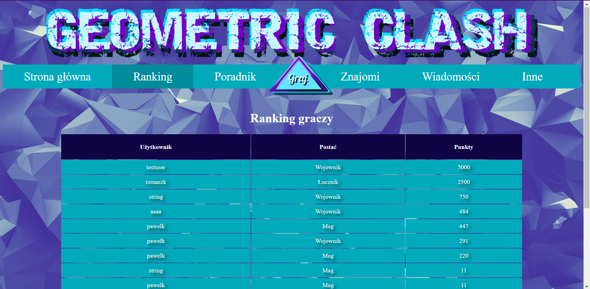

# Geometric Clash App
Web application with puzzle game.  
Group project for university classes.  
>App developed: April - June 2021

## Table of Contents
* [General Info](#general-information)
* [Technologies Used](#technologies-used)
* [Features](#features)
* [Screenshots](#screenshots)
* [Project Status](#project-status)

## General Information
Web application, created as a group project for university classes, with purpose of practicing agile project developement.  
The concept of this application focuses on creating logical puzzle game (tile matching game).  
Beside game, application also allows for a various interactions between users.  
Frontend of this application is based on Angular app and backend on .Net API.  
Database used was MySQL database hosted on remotemysql.com, but currently is not available anymore.  
  
My contributions to this project were mainly on frontend side and focused on:
- Designing app UI and creating graphical assets used in application
- Creating base structure of Angular application with routing and implementing app UI
- Users login and registration handling (including form validation and checking if username is not already registered)
- Storing current user
- Restricting access to certain app features for not logged in users
- Overall game flow and game levels, as well as part of game logic, mechanics and points scoring
- Application tutorial
- Notifications
- Users searching

## Technologies Used
- Angular - version 11.2.4
- .NET
- MySQL

## Features
App features:
- User login and register forms with validation
- Restricting access to game and app features for not logged in users
- Storing current user
- Game - choosing player character, playing game (tile matching game with three levels, player has limited amount of moves, by matching tiles player gets points that lower hp of his oponent, game ends when either player uses all of his moves or deafeats all enemies)
- Displaying game results
- Users ranking
- Displaying user friends, searching for other users and adding them to friends list
- App and game tutorial
- Notifications
- Global chat available for all users
- User profile

## Screenshots

Home page - not logged in user:

Restricting not logged in user access:

Home page with global chat - logged in user:

User login form:

User registration form with validation:

Game - starting panel:

Game - player character choice panel:

Gameplay:

Game results:

Users ranking:

User friends page:

## Project Status
Project is: _complete_  
Currently project is completed. All planned features have been implemented.  
Project was developed from April 2021 to June 2021.
